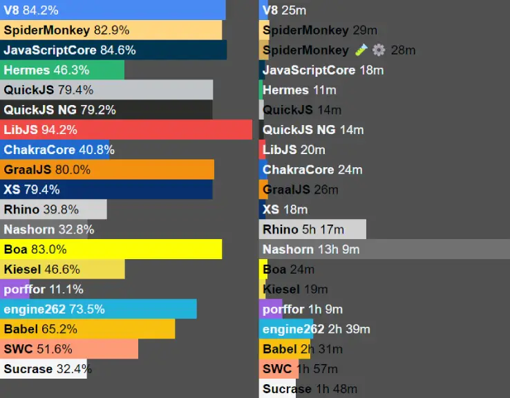

## Summary

Boa v0.18 is now available! After 7 months of development we are very happy to present you the latest release of the Boa
JavaScript engine. Boa makes it easy to embed a JS engine in your projects, and you can even use it from WebAssembly.
See the [about](/about) page for more info.

In this release, our conformance has grown from 78.74% to 84.64% in the official ECMAScript Test Suite (Test262). While
this might look as a small increase, we now pass **6,079** more tests than in the previous version. In any case, the big
changes in this release are not related to conformance, but to huge internal enhancements and new APIs that you will be
able to use.

You can check the full list of changes [here][changelog], and the full information on conformance [here][conformance].

Moreover, this big release was partly possible thanks to those who have [supported us](https://opencollective.com/boa). Thanks to
funds we've recieved we have been able to renew our domain name, renumerate members of the team who have worked on the features released, utilise servers for benchmarking. If you wish to sponsor Boa, you can do so by donating to our [open collective][collective]. You can also check
[easy][easy_issues] or [good first issues][first_issues].

[changelog]: https://github.com/boa-dev/boa/blob/v0.18/CHANGELOG.md
[conformance]: https://boajs.dev/boa/test262/
[collective]: https://opencollective.com/boa
[easy_issues]: https://github.com/boa-dev/boa/issues?q=is%3Aopen+is%3Aissue+label%3AE-Easy
[first_issues]: https://github.com/boa-dev/boa/issues?q=is%3Aopen+is%3Aissue+label%3A%22good+first+issue%22

## Highlights

### We're on [test262.fyi](https://test262.fyi/)!

Thanks to the amazing work of [CanadaHonk](https://twitter.com/CanadaHonk), Boa is now listed on
[test262.fyi](https://test262.fyi/). https://test262.fyi/ runs a nightly build of Boa, along with other engines, and updates the results every day. This is using the tip of the main branch of Boa alongside the [latest test262](https://github.com/tc39/test262) changes pushed to their main branch.

This is a great achievement for us and we are very proud to be listed alongside other major JavaScript engines. It should be much easier for users to compare Boa's conformance tests with other engines.

Below is a screenshot showing Boa being 83% conformance with the latest tests and to the right statistics on the time taken to performa a full test run in comparison to other engines.



### Temporal

The majority of our work over the past few months has been on the Temporal API. The Temporal API is a new set of built-in objects and functions that provide a modern, ECMAScript language standard for date and time manipulation. The Temporal API is designed to be a more modern replacement for the `Date` object, and it provides a more feature-rich and flexible API for working with dates and times.

It is currently a [stage 3 proposal](https://tc39.es/proposal-temporal/docs/) and we are working alongside the TC39 champions to put together a solid implementation. As Temporal is such a large implementation we have done most of the work outside of Boa so that it can be used in other projects. You can find the Temporal implementation in the [temporal_rs](https://github.com/boa-dev/temporal).

We hope to show a full blog post on Temporal in the future, but for now, here is a small example of how to use it:

````rust

TODO show an example of Temporal being used

```rust
// Creates a new module loader that uses the current directory to resolve module imports.

````

### Spec Version Conformance

Something we get asked a lot is _"Do you support ES5 or ES6"_? or _"How far away are you from supporting ESX"_?
We're pleased to say we've updated our conformance board to show you how we're doing across ES versions.

Just navigate to our [Test262 Dashboard][conformance], select "Test Results" on our main branch, and
then you can use the dropdown underneath to see how we're doing on each version. ES5 and ES6 are very close, you can see
we're only a few tests away from them being fully implemented.

### Optimizations

## Conclusions

If you reached so far, you probably understand how big this release was, and you can find even more changes in the
[full changelog][changelog]. Boa is now becoming a real option for many projects, which shows with the amount of
financial support we have received these last months. Nevertheless, going forward, we need your help to get to a 1.0
version. Whether you are good with Rust, JavaScript, documentation or development, we have multiple
[good first issues][first_issues], and places where we [need help][help_wanted], both in Boa's
[main repository][boa_engine] and [others][boa_org] around it.

Once again, big thanks to [all the contributors][contributors] of this release!!

[help_wanted]: https://github.com/boa-dev/boa/issues?q=is%3Aopen+is%3Aissue+label%3A%22help+wanted%22
[boa_engine]: https://github.com/boa-dev/boa
[boa_org]: https://github.com/boa-dev
[contributors]: https://github.com/boa-dev/boa/graphs/contributors?from=2022-10-24&to=2023-07-05&type=c
