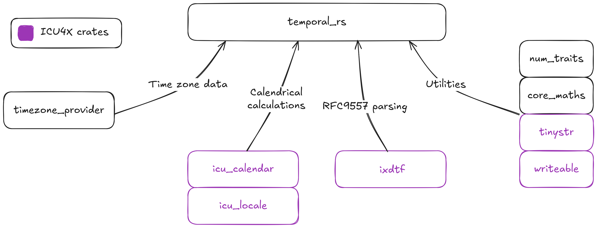

After almost 2+ years of development, we're pleased to announce the 0.1
release of `temporal_rs`. A calendar and time zone aware Rust date/time
library based on ECMAScript's [Temporal API][mdn].

`temporal_rs` is a highly conformant implementation of the Temporal API
in Rust that can be used in native Rust code or embedded into ECMAScript
engines / interpreters to support their implementations, which we first
announced in our first
[Temporal blog post](../2025-06-15-temporal-impl-1.md), if you're
interested in learning more about small implementation details.

Currently, `temporal_rs` is being used by Boa, [Kiesel][kiesel-site],
[V8][v8-site], and [Yavashark][yavashark-repo] for their Temporal
implementations (more on that later) and will soon being
[shipping in Chrome](https://chromestatus.com/feature/5668291307634688).

To celebrate the 0.1 release of `temporal_rs`, we'll cover a short
background of the Temporal implementation in Boa and why `temporal_rs`
was split into it's own crate, we'll go over the library's general
design, and then we'll walk through a couple brief examples of using
`temporal_rs` before finally talking about the FFI and engine adoption.

## Some background and history

In this section, we'll reflect on the overall implementation, some
general difficulties we had along with lessons learned.

The temporal implementation in Boa began over two years ago and
culminated in an absolutely massive PR,
[#3277](https://github.com/boa-dev/boa/pull/3277) (ASIDE from nekevss:
mea culpa).

The PR itself stubbed out a lot of the methods, implemented some
Duration and Instant functionality, and started the support for custom
calendars. There were, however, 2 major take aways from this PR: first,
Temporal is a massive specification update; and second, there is a lot
of room to potentially optimize Temporal if we do not deal with
`JsValue` directly.

After a couple weeks, the question came up amongst the maintainers:
could we separate the Boa's implementation off into a completely
separate library? Sure, why not.

The first commit of then `boa_temporal` occurred in PR
[#3461](https://github.com/boa-dev/boa/pull/3461), which moved the
majority of the existing functionality into a separate crate with the
primary concern at the time of being able to support custom calendars,
which was then ported into it's
[own repository later](https://github.com/boa-dev/temporal/pull/1) a
couple months later.

These early versions of `temporal_rs` were vastly different than the 0.1
release version, and it can be easily seen with a short glance through
the first PR. `temporal_rs` needed to support custom calendars and time
zones. In order to do this, each calendar was generic on a
`CalendarProtocol` trait.

So to create a new date in the early versions of `temporal_rs`, you
would have something like the following code:

```rust
use temporal_rs::{Date, Calendar, options::ArithmeticOverflow};
let date = Date::new_with_overflow(
    2025,
    9,
    21,
    Calendar::<()>::from_str("iso8601").unwrap(),
    ArithmeticOverflow::Reject
).unwrap();
```

Luckily, custom calendars and time zones were removed from the
specification in the first half of 2024, so `temporal_rs` was able to
remove that support, which greatly benefitted the entire API. For
instance, here's the same code in the 0.1 version of `temporal_rs`:

```rust
use temporal_rs::PlainDate;
let date = PlainDate::try_new_iso(2025, 9, 21).unwrap();
```

That was 2024 though, we're in September of 2025, so what's happened
since the crate was initially split off from Boa over a year and a half
ago? Well, plenty!

- In early 2024 the internal algorithm for `Duration` was overhauled in
  the specification, so `temporal_rs` had a complete rewrite of
  `Duration`.
- `Duration` moved from using `f64` internally to `FiniteF64`, and then
  to non-floating-point integers.
- We moved from a large `TemporalFields` type to "Partial" objects,
  which better represent JavaScript property bags.
- A good portion of missing method implementations were added as well.
- Internal utility methods were moved to the Neri-Schneider algorithms.

In general, the implementation was moving along at a pretty decent pace,
and would continue to do so well into roughly April of 2025 (mostly
helped along by a group of students from the University of Bergen who
began helping with the implementation in January 2025), but there were
two final hurdles: time zone data and `ZonedDateTime`.

Time zones and time zone data are a topic for a completely different
blog post in the future. But suffice to say, it took a little bit of
time, and `ZonedDateTime` was developed alongside the time zone data.

This work began in November 2024, by stubbing out the general support of
time zone data sourcing and `ZonedDateTime`. Then, after almost 10
months of general work, the last major updates to time zone data
sourcing were merged at the beginning of September in PR
[#537](https://github.com/boa-dev/temporal/pull/537) and
[#538](https://github.com/boa-dev/temporal/pull/538). As a result, we
were finally able to stabilize `temporal_rs`'s API for a 0.1 release.

That's it for our brief background on `temporal_rs`.

Date and time is hard, and there is a lot that goes into it, especially
when it comes to calendars and time zones. But that's what makes it
interesting!

## Temporal API overview

The Temporal API focuses on a group of 8 date and time types, each of
which corresponds to a different aspect of date and time with varying
support for calendars and time zones, which are, unsurprisingly,
represented in `temporal_rs` by the `Calendar` and `TimeZone` types.

| Temporal type  | Category                          | Calendar support | Time zone support |
| -------------- | --------------------------------- | ---------------- | ----------------- |
| PlainDate      | Calendar date                     | yes              | no                |
| PlainTime      | Wall-clock time                   | no               | no                |
| PlainDateTime  | Calendar date and wall-clock time | yes              | no                |
| ZonedDateTime  | Calendar date and exact time      | yes              | yes               |
| Instant        | Exact time                        | no               | no                |
| Duration       | Time span                         | no               | no                |
| PlainYearMonth | Calendar date                     | yes              | no                |
| PlainMonthDay  | Calendar date                     | yes              | no                |

There is also `Now`, which provides access to the current host system
time. This can then be used to map the current `Instant` to any of the
above Temporal types.

The types in the same categories will share similar APIs that are
related to that category. For instance, all types that support a
calendar date will have a `with_calendar` method as well as calendar
date accessors. The exception being PlainYearMonth and PlainMonthDay
which are missing their day and year, respectively ... for all intents
and purposes.

For a full view of the API, we recommend checking our
[documentation](https://docs.rs/temporal_rs/latest/temporal_rs/).

## `temporal_rs` design overview

`temporal_rs` in general implements large portions of the specification
directly in the codebase. However, it does still have some dependencies,
which can be broken down into 4 main groups.

1. Time zone data, for sourcing time zone data
2. Calendrical calculations, for handling non-ISO calendar calculations
3. RFC9557 parsing, for parsing of RFC9557's internet extended date/time
   format (IXDTF)
4. Utilities



Notably, the dependencies that are highlighted in purple come from
ICU4X. ICU4X is a phenomenal Rust project that takes a new approach to
Unicode's ICU in order to make a new, more modular version of ICU.

While ICU4X provides the majority of the internationalization (i18n),
Unicode, and formatting focused functionality, `temporal_rs` builds on
top of ICU4X to provide an ECMAScript compliant date/time API for both
native Rust and ECMAScript implementers.

### Time zone data

While we plan to go into time zones in a completely separate post, one
of `temporal_rs`'s primary design decisions was to offer a way to
customize the source of time zone data, while also having an optional
default source for convenience. The time zone data sourcing
functionality is provided by `timezone_provider`, a sister crate of
`temporal_rs` that provides a project agnostic crate alongside default
trait implementations for sourcing time zone data.

We currently expose three types of provider implementations:

- `CompiledTzdbProvider` (current default), a provider that parses time
  zone data at runtime using data compiled into the binary.
- `FsTzdbProvider`, a provider that parses time zone data at runtime
  using the file system time zone database (if it exists for that OS).
- `ZoneInfo64TzdbProvider`, a provider using ICU's zoneinfo64 resource
  bundle.

We hope to have a zerocopy compiled timezone provider available in the
near future.

## Using `temporal_rs`

Let's dive into using `temporal_rs` from Rust.

### Setup

First, add `temporal_rs` as a dependency to your project using cargo:

```bash
cargo add temporal_rs
```

Or include the below in your project's `Cargo.toml`.

```toml
temporal_rs = "0.1.0"
```

By default, `temporal_rs` will use a compiled time zone data provider
that compiles the time zone data into the binary. If you prefer to use
the file system time zone database or a zoneinfo64 resource bundle, you
can disable the compiled time zone data by setting
`default-features = false`; you can import your preferred provider from
the `timezone_provider` crate, then provide it to any API that requires
a time zone provider.

For instance, to use the `FsTzdbProvider`, your `Cargo.toml` would look
like the following.

```toml
timezone_provider = { version = "0.0.17", features = ["tzif"] }
temporal_rs = { version = "0.1.0", default-features = false, features = ["sys"]}
```

The `sys` feature for `temporal_rs` enables the default implementation
for `Now`, and the `tzif` feature for `timezone_provider` enables the
`FsTzdbProvider`.

Please note: `timezone_provider` is still considered unstable for the
near future.

### Some examples

The below examples will be using `temporal_rs` with the default
features.

#### Retrieve today's date

```rust
use temporal_rs::Temporal;

// We can easily retrieve today's date using `Temporal::now()`
let today = Temporal::now().plain_date_iso(None).unwrap()
```

#### Date operations available

Temporal provides a nice API for working with date and date/time via
`PlainDate` and `PlainDateTime`.

```rust
use std::convert::TryFrom;
use temporal_rs::{Calendar, Temporal, options::DifferenceSettings, partial::PartialDuration};

// We can get today's date
let today = Temporal::now().plain_date_iso(None).unwrap();

// We can also add a Duration.
let partial = PartialDuration::empty().with_days(1);
let tomorrow = today.add(&partial.try_into().unwrap(), None).unwrap();

// We can get the difference between two dates
let diff = today
    .since(&tomorrow, DifferenceSettings::default())
    .unwrap();

// We can change the calendar
let tomorrow_japanese = tomorrow.with_calendar(Calendar::JAPANESE);

// We can retrieve the calendar's RFC9557 string
println!("{tomorrow_japanese}"); // 2025-09-23[u-ca=japanese]
```

#### Working with dates and time zones

You can also easily work with dates and time zones with the
`ZonedDateTime` type.

```rust
use temporal_rs::options::{DifferenceSettings, Disambiguation, OffsetDisambiguation, Unit};
use temporal_rs::{Calendar, Temporal, TimeZone, ZonedDateTime};

// We can parse a ZonedDateTime from utf8 bytes.
let zdt = ZonedDateTime::from_utf8(
    b"2025-03-01T11:16:10Z[America/Chicago][u-ca=iso8601]",
    Disambiguation::Compatible,
    OffsetDisambiguation::Reject,
)
.unwrap();

// We can get the current ZonedDateTime
let today = Temporal::now().zoned_date_time_iso(None).unwrap();

// And we can easily get the difference the two `ZonedDateTime`s
let mut options = DifferenceSettings::default();
options.largest_unit = Some(Unit::Year);
let diff = today.since(&zdt, options).unwrap();
println!("{diff}"); // P6M22D

// We can change the calendar for the `ZonedDateTime`
let today_coptic = today.with_calendar(Calendar::COPTIC);
println!("{today_coptic}"); // 2025-09-23T12:36:56.914365368-05:00[America/Chicago][u-ca=coptic]

// We can also easily convert it into just the date.
let today_plain_date_coptic = today_coptic.to_plain_date();
println!("{today_coptic}"); // 2025-09-23[u-ca=coptic]
```

While we can extend these examples further, a more fun exercise for the
reader would be to take a look at the [Temporal cookbook][cookbook], as
it displays the utility of the Temporal API using JavaScript and all of
these examples are now usable from Rust as well.

## FFI and engine adoption

As previously stated, `temporal_rs` is used in Boa, Kiesel, and V8.
There's just one thing, the latter of the two are ECMAScript
implementations written in Zig and C++, respectively, not Rust. This was
made possible through `temporal_rs`'s FFI crate `temporal_capi`, which
provides C and C++ bindings to `temporal_rs`.

The bindings are autogenerated via [Diplomat][diplomat-repo], which is a
project for generating FFI definitions for Rust libraries. In general,
it's a really cool project and we would definitely recommend checking it
out if you're looking to generate FFI bindings for other languages for
your Rust library.

There is some added benefits to offering C and C++ bindings beyond the
classic: oh, let's (re)write it in Rust.

First, this approach allows other languages and engines to benefit from
Rust's type system and memory safety guarantees without having to
rewrite everything in Rust. It's a more modular and incremental approach
that provides some level of flexibility.

Secondly, with how large the API is, `temporal_rs` streamlines the
ability to adopt the Temporal API for any current and future
implementations, since any future updates can be done primarily in one
place and then released downstream. `temporal_rs` plus the engine
specific integration code, while not a small amount of code, is a
relatively trivial amount of work in comparison to a from scratch
implementation.

Third, with adoption from multiple engines, `temporal_rs` benefits via
external test coverage beyond the native Rust unit tests. For instance,
looking at the engines that offer conformance numbers (Boa, Kiesel, and
V8), each implementation is currently north of 95% conformance with V8
reaching the highest at around 99% conformance. There is still a small
disparity in conformance, but this can be explained by the absence of
some related features, i.e. Boa still hasn't completed its
`Intl.DateTimeFormat` implementation yet so it fails all ECMA402
`toLocaleString` tests. Nonetheless, we can still be fairly confident in
the general correctness of `temporal_rs`, and any potential bugs will
ideally be found and addressed fairly quickly.

In general, `temporal_rs` is a pretty good reference case for setting up
a Rust library over FFI, being used in both a C++ and Zig codebase.

## Conclusion

The 0.1 release of `temporal_rs` is out. We expect the general API to
remain fairly stable moving forward, with any non-patch bumps being for
added features. Feel free to try it out, and provide feedback / file any
issues you come across. Although, we will make changes and semantic
versioning bumps based on feedback or the Temporal specification.

Our current plan is to have any remaining issues addressed and the API
fully stable, in preparation for the "stabilization" of Temporal and its
subsequent introduction to the ECMAScript specification. Once Temporal
is "stabilized", we will move forward with a 1.0 release.

`temporal_rs` started as an interesting experiment in creating an engine
agnostic library of the Temporal API that could also be usable as a
date/time library in native Rust code, but seeing the wide adoption
we've been getting from other engines, we can say that this project has
been a great success! And with any luck, we hope this library will find
its place in the Rust ecosystem as well.

## Special thanks

We'd like to thank all the [contributors] to `temporal_rs` for helping
it get to v0.1.

Thanks to the University of Bergen students who helped drive some of the
major conformance push earlier this year.

Also, a huge thanks to all the Temporal champions for all their work on
the specification, as well as the ICU4X project for their incredible
ongoing work on calendars and all things i18n related.

[mdn]:
  https://developer.mozilla.org/en-US/docs/Web/JavaScript/Reference/Global_Objects/Temporal
[v8-site]: https://v8.dev/
[kiesel-site]: https://kiesel.dev/
[yavashark-repo]: https://github.com/Sharktheone/yavashark
[cookbook]: https://tc39.es/proposal-temporal/docs/cookbook.html
[diplomat-repo]: https://github.com/rust-diplomat/diplomat
[contributors]: https://github.com/boa-dev/temporal/graphs/contributors
