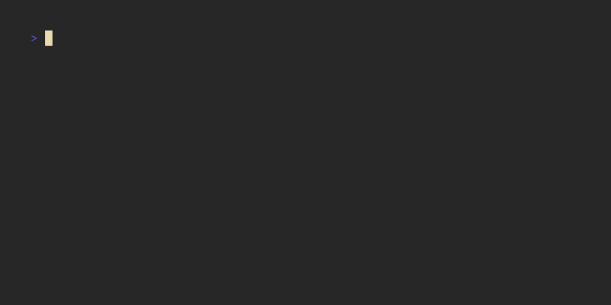

## Summary

Boa v0.21 is now available! After 9 months of development we are very
happy to present you the latest release of the Boa JavaScript engine.
Boa makes it easy to embed a JS engine in your projects, and you can
even use it from WebAssembly. See the [about](/about) page for more
info.

In this release, our conformance has grown from 89.92% to 94.12% in the
official ECMAScript Test Suite (Test262). Our growth in conformance is
driven by increased conformance for Temporal (discussed further below)
with the rest of the development effort being focused on performance,
internal improvements, and runtime features. We will continue to implement
more of the specification; however, as of the current moment, Boa's conformance
aligns with the major browser engine's conformance, so future increases
in conformance will be minor or bound to the feature size going forward.

You can check the full list of changes [here][changelog], and the full
information on conformance [here][conformance].

<!--truncate-->

## Feature Highlights

### Temporal

There has been a lot of progress made on Temporal, the new Stage 3
date/time proposal. With this release, Boa's conformance on Temporal
grew from 40.67% to ~97%. This implementation is backed by the `temporal_rs`
date/time Rust library, which we went over in our announcement
[blog post](../2025-09-24-temporal-release). Give the post a read if you are
interested in `temporal_rs` and its development history.

### Span nodes and error backtraces

We added support for storing spans in our AST nodes, which allows determining the
exact location of an AST node on its original file. We already kind of
supported this feature in our lexer, but we did not store the spans after parsing.

Why is this important? Well, as a direct result from this, Boa now supports error backtraces
when an exception is thrown!


As an additional plus, you can enable the `native-backtrace` feature to include
"native" functions on a backtrace.



This feature has been one of the most requested ones for years,
and we hope it will
greatly help with debugging errors when using Boa.

### Async APIs enhancements

Historically, hooking functions returning a `Future` into Boa has been one of the
biggest pain points of our API. This was mostly caused by how we defined
`FutureJob`:

```rust
pub type FutureJob = Pin<Box<dyn Future<Output = NativeJob> + 'static>>;
```

With this definition, it was pretty much impossible to capture the `Context`
inside the future, and functions that needed to interweave engine operations
with awaiting `Future`s would have to be split into multiple parts:

```rust
let fetch = async move {
    let body: Result<_, isahc::Error> = async {
        let mut response = Request::get(&url)
            .body(())?
            .send_async()
            .await?;

        Ok(response.text().await?)
    }
    .await;

    // Since the async context cannot take the `context` by ref, we have to continue
    // parsing inside a new `NativeJob` that will be enqueued into the promise job queue.
    NativeJob::new(move |context| -> JsResult<JsValue> {
        parse(body).await;

        // Also needed to match `NativeJob::new`.
        Ok(JsValue::undefined())
    })
};

// Just enqueue the future for now. We'll advance all the enqueued futures inside our custom
// `JobQueue`.
context
    .job_queue()
    .enqueue_future_job(Box::pin(fetch), context)
}
```

We wanted to improve this API, and the solution we thought about was to make
`Context` shareable by wrapping it using `RefCell`. However, this proved to be
very difficult for two reasons:
1. We needed to change all definitions to take `&RefCell<Context>` instead
   of `&mut Context`, which meant changing pretty much the whole codebase.
2. Some of our VM code was reentrant, which meant calling `RefCell::borrow_mut`
   would cause panics in the reentrant parts of the code; we would need to
   redesign some parts of the engine to remove the reentrancy.

After putting a lot of thought on this, we came up with a really nice solution;
instead of wrapping `Context` with `RefCell`, we would wrap `&mut Context` with
`RefCell`, and only on the async-related APIs. This would allow not only capturing
the context to `Future`-related functions, but also doing this without having to
refactor big parts of the code. Thus, we ditched `FutureJob` and introduced a new
type of job: `NativeAsyncJob`.

```Rust
/// An ECMAScript [Job] that can be run asynchronously.
///
/// This is an additional type of job that is not defined by the specification, enabling running `Future` tasks
/// created by ECMAScript code in an easier way.
#[allow(clippy::type_complexity)]
pub struct NativeAsyncJob {
    f: Box<dyn for<'a> FnOnce(&'a RefCell<&mut Context>) -> BoxedFuture<'a>>,
    realm: Option<Realm>,
}
```

With this change, any API that integrates with `Future` can additionally capture
the `&RefCell<&mut Context>` to run engine-related operations after awaiting on
a `Future`.

### Revamped `JobQueue`

After introducing the new job type, changes had to be made on
[`JobQueue`](https://docs.rs/boa_engine/0.20.0/boa_engine/job/trait.JobQueue.html)
to better support new job types. Thus, `JobQueue` was revamped and renamed to be the
new `JobExecutor`:

```rust
/// An executor of `ECMAscript` [Jobs].
///
/// This is the main API that allows creating custom event loops.
///
/// [Jobs]: https://tc39.es/ecma262/#sec-jobs
pub trait JobExecutor: Any {
    /// Enqueues a `Job` on the executor.
    ///
    /// This method combines all the host-defined job enqueueing operations into a single method.
    /// See the [spec] for more information on the requirements that each operation must follow.
    ///
    /// [spec]: https://tc39.es/ecma262/#sec-jobs
    fn enqueue_job(self: Rc<Self>, job: Job, context: &mut Context);

    /// Runs all jobs in the executor.
    fn run_jobs(self: Rc<Self>, context: &mut Context) -> JsResult<()>;

    /// Asynchronously runs all jobs in the executor.
    ///
    /// By default forwards to [`JobExecutor::run_jobs`]. Implementors using async should override this
    /// with a proper algorithm to run jobs asynchronously.
    async fn run_jobs_async(self: Rc<Self>, context: &RefCell<&mut Context>) -> JsResult<()>
    where
        Self: Sized,
    {
        self.run_jobs(&mut context.borrow_mut())
    }
}
```

As you can probably tell, we made a lot of changes on the `JobExecutor`:

TODO

### Revamped `ModuleLoader`

TODO

### Built-ins updates

#### Set methods

This release adds support for the new set methods added in ECMAScript's 2025
specification.

The new methods are:

- `Set.prototype.intersection(other)`
- `Set.prototype.union(other)`
- `Set.prototype.difference(other)`
- `Set.prototype.symmetricDifference(other)`
- `Set.prototype.isSubsetOf(other)`
- `Set.prototype.isSupersetOf(other)`
- `Set.prototype.isDisjointFrom(other)`

Thanks to [@Hemenguelbindi](https://github.com/@Hemenguelbindi) for
their work on this feature.

#### Float16 support for TypedArrays, Dataview and Math built-ins

This release adds support for `f16` types for the TypedArray, Dataview, and Math
built-ins.

```javascript
const x = new Float16Array([37, 42.123456]);
console.log(x[1]); // 42.125
```

#### Error.isError

This release adds support for `Error.isError`, which will be introduced in
ECMAScript's 2026 specification.

```javascript
console.log(Error.isError(new Error())); // true
console.log(Error.isError({ __proto__: Error.prototype })); // false
```

#### Math.sumPrecise

This release adds support for `Math.sumPrecise`, which will be introduced in
ECMAScript's 2026 specification.

We've opted for using the new [`xsum`](https://crates.io/crates/xsum) summation algorithm
for the underlying implementation.

```javascript
let sum = Math.sumPrecise([1e20, 0.1, -1e20]);
console.log(sum); // 0.1
```

#### Atomics.waitAsync

TODO


#### Array.fromAsync

## Boa Runtime

Work on Boa's runtime crate has continued with additional APIs added.

### Additional APIs

Additional APIs added the the Runtime crate include:

- `fetch`
- `setTimeout`
- `setInterval`
- `clearInterval`
- `queueMicrotask`

### Conformance testing

We've added some support for conformance testing runtime features
against the Web Platform Tests (WPT).

## Performance

### NaN Boxing

With this release, Boa's `JsValue` will use nan-boxing by default. The NaN boxing of `JsValue`
increased memory and runtime performance over the older enum.

As a note, the current implementation is not compatible with all platforms. While we hope
to address this in the future, the legacy enum JsValue will be available via the `jsvalue-enum`
feature flag.

Unfamiliar with NaN Boxing? We won't go over it in depth here, but we recommend
[this article](https://piotrduperas.com/posts/nan-boxing) to learn more.

### Register VM

Boa's virtual machine (VM) moved from a stack based VM to a register based VM in
[PR #3798](https://github.com/boa-dev/boa/pull/3798).

## New Contributors

TODO

## Looking Forward

### Garbage collector rewrite

This has been long overdue. Boa's garbage collector is a forked and
modified verison of `rust-gc`, and we have long been pushing our forked
gc to its limits.

We have seen some evidence from previous pull requests that simply swapping
allocators from Rust's global allocator can increase Boa's performance, and
work on this will hopefully resume soon. If you're interested in garbage
collectors and/or would be interested in helping out, feel free to join our
GC room on [Matrix].

### Runtime functionality

The `boa_runtime` crate was initially meant to contain functionality
that was not meant to exist in the core ECMAScript implementation, for instance
the console implementation. Noticeably, we have since added more runtime
features to the crate with even more features expected in the next release.

Our current plan is if there is enough interest and the crate becomes
too large, we will split `boa_runtime` into it's own repository. If you
are interested in implementing any runtime features or contributing to
a runtime, feel free to reach out.

### Continuing performance improvements

As mentioned on previous release posts, we will continue to further work
on improving Boa's overall performance.

### `Intl` and ECMA402 conformance

We currently have some general support for the ECMA402 and ECMAScript's `Intl` object. We
will continue to some general work on ECMA402 conformance to allow Boa to be fully usable
for internationalization use cases.

## How can you support Boa?

Boa is an independent JavaScript engine implementing the ECMAScript
specification, and we rely on the support of the community to keep it
going. If you want to support us, you can do so by donating to our [open
collective]. Proceeeds here go towards this very website, the domain
name, and remunerating members of the team who have worked on the
features released.

If financial contribution is not your strength, you can contribute by
asking to be assigned to one of our [open issues], and asking for
mentoring if you don't know your way around the engine. Our
[contribution guide] should help you here. If you are more used to
working with JavaScript or frontend web development, we also welcome
help to improve our web presence, either in [our website], or in our
[testing representation] page or benchmarks page. You can also
contribute to our Criterion benchmark comparison GitHub [action].

We are also looking to improve the documentation of the engine, both for
developers of the engine itself and for users of the engine. Feel free
to contact us in [Matrix].

[open collective]: https://opencollective.com/boa
[open issues]:
  https://github.com/boa-dev/boa/issues?q=is%3Aopen+is%3Aissue+no%3Aassignee
[contribution guide]:
  https://github.com/boa-dev/boa/blob/main/CONTRIBUTING.md
[our website]: https://github.com/boa-dev/boa-dev.github.io
[testing representation]: https://github.com/boa-dev/boa/issues/820
[action]: https://github.com/boa-dev/criterion-compare-action
[Matrix]: https://matrix.to/#/#boa:matrix.org

## Thank You

Once again, big thanks to [all the contributors][contributors] of this
release!!!

[contributors]:
  https://github.com/boa-dev/boa/graphs/contributors?from=2024-12-05&to=2025-08-30&type=c
[changelog]: https://github.com/boa-dev/boa/blob/v0.21/CHANGELOG.md
[conformance]: https://boajs.dev/boa/test262/
[feed]: https://boajs.dev/blog/rss.xml
[collective]: https://opencollective.com/boa
[easy_issues]:
  https://github.com/boa-dev/boa/issues?q=is%3Aopen+is%3Aissue+label%3AE-Easy
[first_issues]:
  https://github.com/boa-dev/boa/issues?q=is%3Aopen+is%3Aissue+label%3A%22good+first+issue%22
